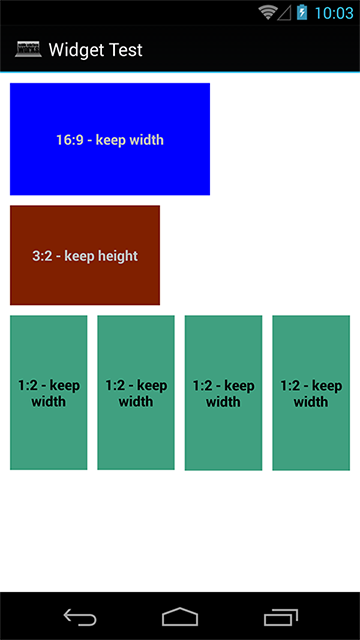

Works Widget
===========

Android Basic Widget such as

- ConstrainedFrameLayout which allows you to create a width height ratio constrained layout

 
Figure. 1 - Constrained FrameLayout

Layout examples:
<code>
<pre>
<view
            class="works.ConstrainedFrameLayout"
            android:layout_width="wrap_content"
            android:layout_height="wrap_content"
            works:ratioHorizontal="integer"
            works:ratioVertical="integer"
            works:keep="width|height">
</pre>
</code>

This widget is especially useful for handling ImageView dimension. 